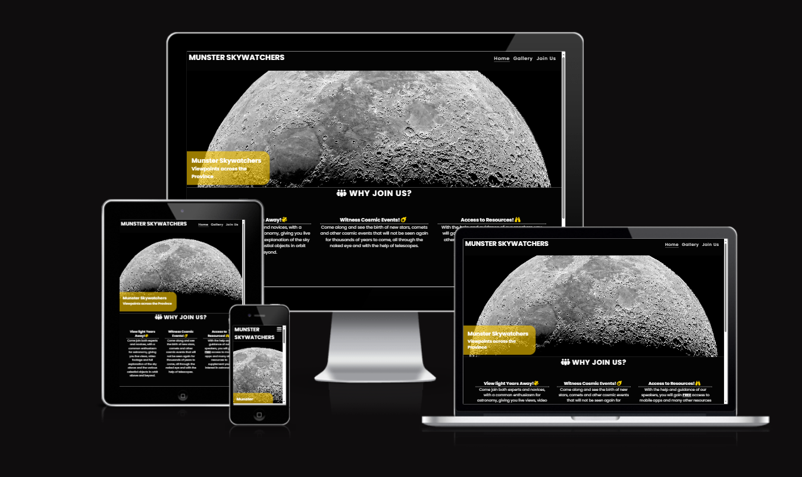
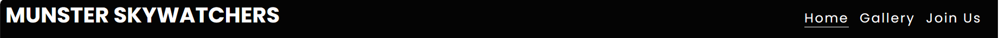
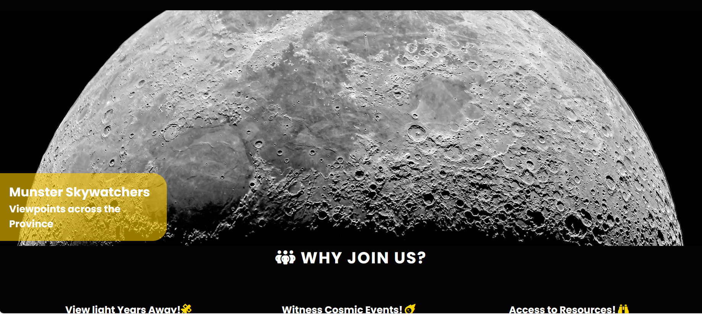
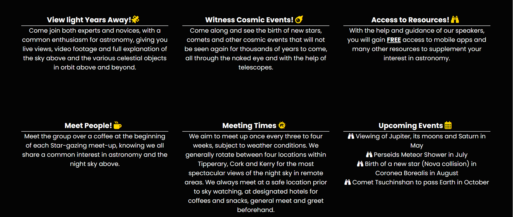
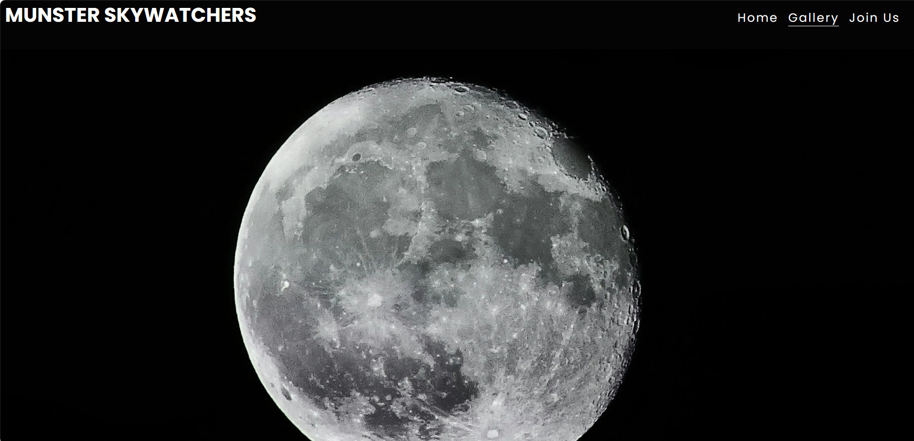
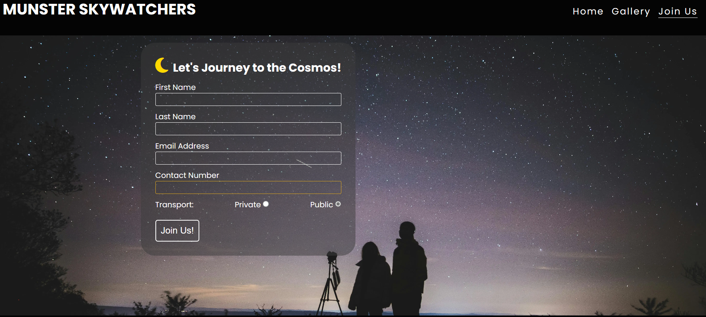

# Munster Skywatchers
The Munster Skywatchers website was designed with astronomy enthusiasts in mind as a way to link up people with a similar interest with a view to meeting up every few weeks for night sky watching events where they can meet up for coffee and view scheduled events in the night sky. Whilst using Munster as its base for sky watching events, it is open to all who are interested in signing up to join the group. The purpose of the meet ups is to educate group members on the various objects and events that are happening within our solar system and beyond. There is also a social aspect to the gatherings with coffee meet-ups as a form of meet and greet which is very helpful for new members to the group, along with the outlining of the importance of safety as meet-ups generally take place in one of four locations at night throughout the Munster region.
The url for the deployed site as accessible [here](https://petermcloughlin.github.io/munster-skywatchers/).

* Contents
    * Features
    * User Experience / User Interface
    * Testing
    * Deployment
    * Bugs / Fixes
    * Citations of Sources

## Features
The Munster Skywatchers website is comprised of three webpages:
* index.html
    - This is the homepage or landing page in which the detailed content of what we are about and what we offer to new members is outlined.   
* gallery.html
    - This page displays some images of celestial objects and events that have been previously witnessed.
* joinus.html
    - The joinus.html page contains a form which allows interested visitors, to sign up to our group and be notified of upcoming events which they can attend. 
### Common features 
Both the navbar and footer are common features to the website giving a simple flow to the user experience as they navigate the website. The navbar utiltises a collapsed burger icon image on mobile devices , expanding to show the websites navigation pages on the top right of each page on larger devices such as tablets, laptops and desktops.
* Navbar

    The footer contains four social media links to Facebook, Instagram, Twitter and YouTube, all of which open in a new tab when clicked by the user. On devices such as tablets, laptops and Desktops, the gold hover effect keeps the user interface colouring in line with the themed color scheme used across the site, making the user experience more intuitive.
* Footer

### Home Page (Landing page)
The index.html or landing page uses a high resolution hero image of the moon to engage the visitor and demonstrate the kind of detail members would experience when viewing celestial objects such as the moon through our telescopes. This page also details more information about what we do, reason to join us and some information on upcoming events in the summer to autumn of 2024.

### Gallery Page
The gallery.html contains a list of images relating to space, the solar system, celestial events and sky watchers with a final image of coffee mugs on a table reminding the user that there is a social aspect to the the sky watch meet ups.
The images are separated by a small white space on mobiles to define the individuality of each image. I opted to keep the enlargened images with a vertical page scroll on larger screen sizes such as laptops and desktops with a ccs overlay descriptive text block which appears and disappears as the user hovers their mouse over each image. I felt that the enlargened images would ensure the high resolution would be more pleasing to the user , visually.

### Join Us Page
The last page is the joinus.html, where the user gets the opportunity to join the Skywatcher group by completing the form,filling in their Firstname, Lastname, Email, Contact number and selecting Private or Public to notify that they use their own vehicle or public transport when travelling to the Skywatch meet-ups. There is a gold hover effect on each text-input box when the user hovers their mouse over each text-input box to enhance the user experience when interacting with the UI on laptops and desktops. The transparent Join Us button turns green when the users mouse enters the button element on large screens for a more improved, intuitive user experience.
Each text-input box , inluding the radio button options have 'required' attribute that displays an alert promtp to the user if they attempt submit the form without completing these fields. 

## User Experience / User Interface

When designing the website at the planning stage, I tried to keep the target audience in mind when designing the UI display. The target audience in this case would predominently be astronomy enthusiasts, experts and novices, who would like to enjoy the educational and social experience that comes with signing up to be a member of the Skywatcher group. The name 'Munster Skywatchers' is to place emphasis on the locations of our viewing points across the Munster region of Ireland.

The colour selection of #040404 for the backgrounds, #ffffff for text and some icons , along with #gold and #goldrun for icons and text-input hover effect worked well with the high resolution image of the moon on the landing page and the background image on the joinus.html page.

I checked the color contrasts using [webaim.org](https://webaim.org/resources/contrastchecker/) to ensure it would provide enough contrast for visually impaired visitors to the site.

### User Story
As a visitor, the user of the website;
* will want to discover more information about what the Munster Skywatchers do
* will see some images that visually correlate the text content to their understanding of what is involved in Skywatch meet-ups.
* will be able to avail of the option to join the group by competing the form on the last page to become a member and available of notifications of upcoming Skywatch meetings
* will be able to potentially view the groups social media links to gain a greater sense of what is involved, with access to the icons in the footer of the website. (For the purposes of this website, the footer social media links only take to the user to the standard social media sign in pages)

### Wireframes
At the initial stage of planning, I created some mobile-first approach wireframes to demonstrate a visual display of the user interface.
Below are a snapshot of the wireframes, one for each page on the website. The final project deviated slightly from the exact design laid out.
* [Index.html](docs/readme_images/Index_wireframe.PNG)
* [Gallery.html](docs/readme_images/Gallery_wireframe.PNG)
* [JoinUs.html](docs/readme_images/JoinUs_wireframe.PNG)

## Testing
The testing of the Munster Skywatchers website was ongoing throughout the development stages, including the use of element inspection for addition of new elements to the pages before committing to GitHub. Testing of the website included the following approaches;
* Manual Testing
* HTML Validation
* CSS Validation
* Lighthouse Inspection
* Responsiveness

### Manual Testing
As a manual test of the website, I accessed the delpoyed url on a variety of devices such as iPhone, Android mobile, Tablet, iPad, laptop and Desktop to view the sites visual responsiveness, access to the footer links, completion of the joinus.html form and toggling of the burger icon and navbar links.
The form validation alerts appeared to work fine on larger devices such as laptops and dekstops, with the hover effect on the text-input boxes turning a border color of gold and the submit button turning dark-green on hover.

